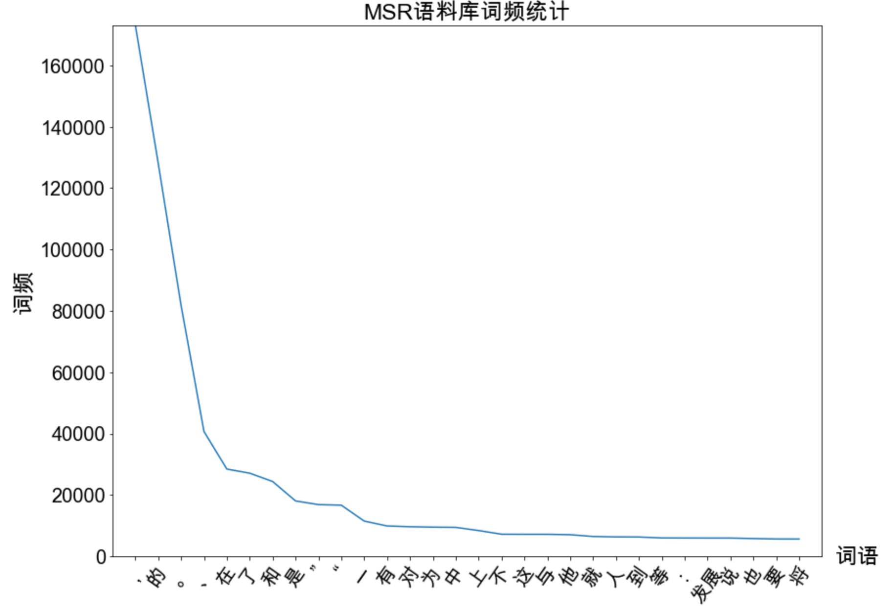
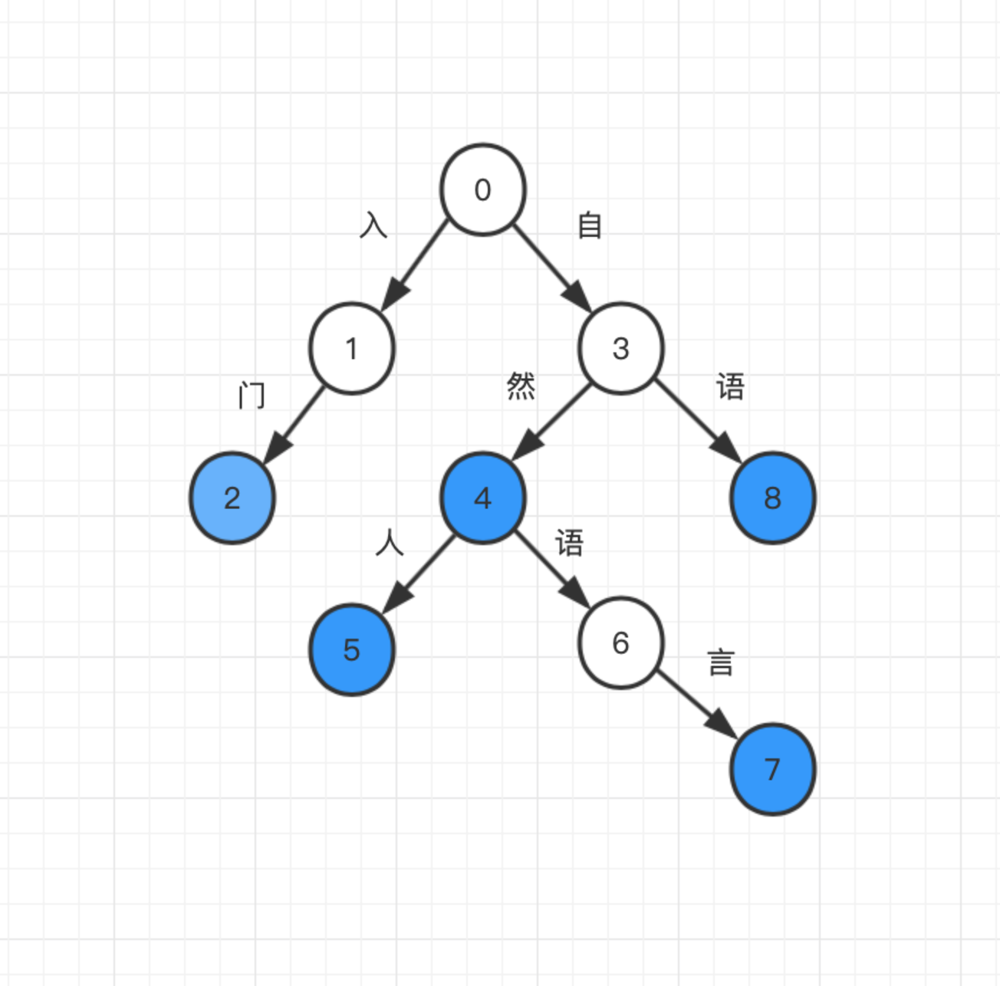

# 词典分组

[TOC]

>**中文分词**指的是将一段文本拆分成一系列单词的过程，这些单词顺序拼接后等于原文本。中文分词算法大致分为给予词典规则和基于机器学习这两大流派。
>
>**词典分组**是最简单最常见的基于规则的分词算法，仅需一部词典和一套查词的规则即可。词典分词的重点不在于分词本身，而在于支撑词典的数据结构。

## 1. 什么是词

在语言学上，词语的定义是具备独立意义的最小单位。在基于词典的中文分词中，词典中的字符串就是词。

**齐夫定律**：一个单词的词频与它的词频排名成反比。MSR语料库（微软亚洲研究院语料库）上的统计结果验证了这一定律。



横坐标是按照词频排名降序排列的前30个常用词，纵坐标是相应的词频。虽然存在很多生词，但是越往后，词频越小，趋近于0。

实现词典分组的第一步，就是准备一份词典。

## 2. 词典

互联网词库(SogouW， 15万个词条)、清华大学开放中文词库(THUOCL)、HanLP词库(千万级词条)

这里以HanLP附带的迷你核心词典为例:

```
希望	v	386	n	96	
希特勒	nr	3
希玛	nz	1
希罕	a	1
希翼	v	1
希腊	ns	19
```

HanLP中的词典格式是一种以空格分隔的表格形式，第一列是单词本身，之后每两列分别表示词性与相应的词频。

### 2. 1词典的加载

```python
def load_dictionary():
    """
    加载HanLP中的mini词库
    :return: 一个set形式的词库
    """
    IOUtil = JClass('com.hankcs.hanlp.corpus.io.IOUtil')
    path = HanLP.Config.CoreDictionaryPath.replace('.txt', '.mini.txt')
    dic = IOUtil.loadDictionary([path])
    return set(dic.keySet())
```

## 3. 切分算法

词典分词常用的规则有正向最长匹配、逆向最长匹配和双向最长匹配，它们都属于完全切分过程。

### 3.1 完全切分

**完全切分**指的是，找出一段文本中的所有单词。

```python
def fully_segment(text, dic):
    word_list = []
    for i in range(len(text)):                  # i 从 0 到text的最后一个字的下标遍历
        for j in range(i + 1, len(text) + 1):   # j 遍历[i + 1, len(text)]区间
            word = text[i:j]                    # 取出连续区间[i, j]对应的字符串
            if word in dic:                     # 如果在词典中，则认为是一个词
                word_list.append(word)
    return word_list
  
dic = load_dictionary()
print(fully_segment('商品和服务', dic))
```

输出：

```shell
['商', '商品', '品', '和', '和服', '服', '服务', '务']
```

### 3.2 正向最长匹配

上面的输出并不是中文分词，中文分词想要的是那种有意义的词语序列，而不是所有出现在词典中的单词所构成的链表。在以某个下标为起点递增查词的过程中，优先输出更长的单词，这种规则被称为**最长匹配算法**。扫描顺序从前往后匹配则称为**正向最长匹配**，反之则称为**逆向最长匹配**。

```python
def forward_segment(text, dic):
    word_list = []
    i = 0
    while i < len(text):
        longest_word = text[i]                      # 当前扫描位置的单字
        for j in range(i + 1, len(text) + 1):       # 所有可能的结尾
            word = text[i:j]                        # 从当前位置到结尾的连续字符串
            if word in dic:                         # 在词典中
                if len(word) > len(longest_word):   # 并且更长
                    longest_word = word             # 则更优先输出
        word_list.append(longest_word)              # 输出最长词
        i += len(longest_word)                      # 正向扫描
    return word_list

dic = load_dictionary()
print(forward_segment('就读北京大学', dic))
print(forward_segment('研究生命起源', dic))
```

输出：

```
['就读', '北京大学']
['研究生', '命', '起源']
```

可以看出，第二句话产生了误差，希望提取的是“研究”，但是正向最长匹配算法就提取出了“研究生”，所以人们就想出了逆向最长匹配。

### 3.3 逆向最长匹配

逆向最长匹配与正向最长匹配唯一的区别就是扫描的方向不同。

```python
def backward_segment(text, dic):
    word_list = []
    i = len(text) - 1
    while i >= 0:                                   # 扫描位置作为终点
        longest_word = text[i]                      # 扫描位置的单字
        for j in range(0, i):                       # 遍历[0, i]区间作为待查询词语的起点
            word = text[j: i + 1]                   # 取出[j, i]区间作为待查询单词
            if word in dic:
                if len(word) > len(longest_word):   # 越长优先级越高
                    longest_word = word
                    break
        word_list.insert(0, longest_word)           # 逆向扫描，所以越先查出的单词在位置上越靠后
        i -= len(longest_word)
    return word_list


if __name__ == '__main__':
    dic = load_dictionary()
    print(backward_segment('研究生命起源', dic))
    print(backward_segment('项目的研究', dic))
```

输出：

```
['研究', '生命', '起源']
['项', '目的', '研究']
```

这次得到了正确的结果，['研究', '生命', '起源']，但是对于“项目的研究”的分词结果又产生了误差，因此，另一些人提出综合两种规则，期待它们取长补短，称为双向最长匹配。

### 3.4 双向最长匹配

这是一种融合两种匹配方法的复杂规则集，流程如下：

- 同时执行正向和逆向最长匹配，若两者的词数不同，则返回词数更少的那一个。
- 否则，返回两者中单字更少的那一个。当单字数也相同时，优先返回逆向最长匹配的结果。

```python
def count_single_char(word_list: list):  # 统计单字成词的个数
    return sum(1 for word in word_list if len(word) == 1)


def bidirectional_segment(text, dic):
    f = forward_segment(text, dic)
    b = backward_segment(text, dic)
    if len(f) < len(b):                                  # 词数更少优先级更高
        return f
    elif len(f) > len(b):
        return b
    else:
        if count_single_char(f) < count_single_char(b):  # 单字更少优先级更高
            return f
        else:
            return b                                     # 都相等时逆向匹配优先级更高     

print(bidirectional_segment('研究生命起源', dic))
print(bidirectional_segment('项目的研究', dic))
```

## 4. 字典树

### 4.1 字典树定义

匹配算法的瓶颈之一在于如何判断集合(词典)中是否含有字符串。如果用有序集合(TreeMap)的话，复杂度是o(logn) ( n是词典大小)；如果用散列表( Java的HashMap，Python的dict)的话，时间复杂度虽然下降了，但内存复杂度却上去了。有没有速度又快、内存又省的数据结构呢？这就是**字典树**。

字符串集合常用**字典树**(又称trie树、前缀树)存储，这是一种字符串上的树形数据结构。字典树中每条边都对应一个字， 从根节点往下的路径构成一个个字符串。字典树并不直接在节点上存储字符串， 而是将词语视作根节点到某节点之间的一条路径，并在终点节点(蓝色) 上做个标记“该节点对应词语的结尾”。字符串就是一 条路径，要查询一个单词，只需顺着这条路径从根节点往下走。如果能走到特殊标记的节点，则说明该字符串在集合中，否则说明不存在。一个典型的字典树如下图所示。



其中，蓝色标记着该节点是一个词的结尾，数字是人为的编号。按照路径我们可以得到如下表所示：

| 词语     | 路径      |
| -------- | --------- |
| 入门     | 0-1-2     |
| 自然     | 0-3-4     |
| 自然人   | 0-3-4-5   |
| 自然语言 | 0-3-4-6-7 |
| 自语     | 0-3-8     |

### 4.2 字典树实现

​		由上图可知，每个节点都至少应该知道自己的子节点与对应的边，以及自己是否对应一个词。如果要实现映射而不是集合的话，还需要知道自己对应的值。在HanLP中，约定用None值表示节点不对应词语，这样就不能插入值为None的键了，但是实现起来更加简洁。

​		节点实现用python描述如下：

```python
class Node(object):
    def __init__(self, value) -> None:
        self._children = {} # 定义子节点
        self._value = value # 定义当前节点的值

    def _add_child(self, char, value, overwrite=False):
        child = self._children.get(char)
        if child is None:
            child = Node(value)                 # 创建子节点
            self._children[char] = child        # 子节点赋值，字->节点的映射
        elif overwrite:
            child._value = value                # 节点上对应的词
        return child


class Trie(Node):
    def __init__(self) -> None:
        super().__init__(None)

    def __contains__(self, key):
        return self[key] is not None

    def __getitem__(self, key):
        state = self
        for char in key:
            state = state._children.get(char)
            if state is None:
                return None
        return state._value

    def __setitem__(self, key, value):
        state = self
        for i, char in enumerate(key):
            if i < len(key) - 1:
                state = state._add_child(char, None, False)
            else:
                state = state._add_child(char, value, True)    # 最后一个表示词
```

### 4.3 基于字典树的改进算法

在字典树的基础上，自然语言处理入门的作者何晗老师提出了多种改进优化算法，把分词速度推向了千万字每秒的级别，改进算法包括：

* 首字散列其余二分的字典树
* 双数组字典树
* AC自动机
* 基于双数组字典树的AC自动机

## 5. HanLP的词典分词实现

HanLP中所有的分词器都继承自Segment这个基类。

### 5.1 **DoubleArrayTrieSegment**

**DoubleArrayTrieSegment**分词器是对DAT最长匹配的封装，默认加载hanlp.properties中CoreDictionaryPath指定的词典。python调用如下：

```python
from pyhanlp import *

# 不显示词性，显示词性为
HanLP.Config.ShowTermNature = False
# 可传入自定义字典，自定义字典放入list中作为参数，如[dir1, dir2]
segment = DoubleArrayTrieSegment()
# 激活数字和英文识别
segment.enablePartOfSpeechTagging(True)

print(segment.seg("江西鄱阳湖干枯，中国最大淡水湖变成大草原"))
print(segment.seg("上海市虹口区大连西路550号SISU"))
```

输出：

```
[江西, 鄱阳湖, 干枯, ，, 中国, 最大, 淡水湖, 变成, 大草原]
[上海市, 虹口区, 大连, 西路, 550, 号, SISU]
```

### 5.2 去掉停用词

```python
def load_from_file(path):
    """
    从词典文件加载DoubleArrayTrie
    :param path: 词典路径
    :return: 双数组trie树
    """
    map = JClass('java.util.TreeMap')()  # 创建TreeMap实例
    with open(path) as src:
        for word in src:
            word = word.strip()  # 去掉Python读入的\n
            map[word] = word
    return JClass('com.hankcs.hanlp.collection.trie.DoubleArrayTrie')(map)


## 去掉停用词
def remove_stopwords_termlist(termlist, trie):
    return [term.word for term in termlist if not trie.containsKey(term.word)]

trie = load_from_file('stopwords.txt')
termlist = segment.seg("江西鄱阳湖干枯了，中国最大的淡水湖变成了大草原")
print('去掉停用词前：', termlist)

print('去掉停用词后：', remove_stopwords_termlist(termlist, trie))
```

输出：

1. ```
   去掉停用词前： [江西, 鄱阳湖, 干枯, 了, ，, 中国, 最大, 的, 淡水湖, 变成, 了, 大草原]
   去掉停用词后： ['江西', '鄱阳湖', '干枯', '中国', '最大', '淡水湖', '变成', '大草原']
   ```

