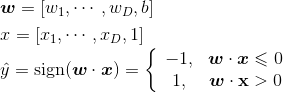
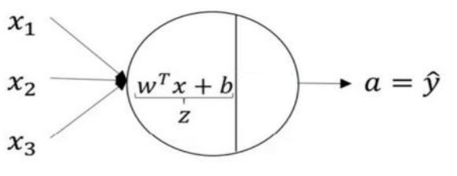

# 感知机模型与系列标注

[TOC]

第4章我们利用隐马尔可夫模型实现了第一个基于序列标注的中文分词器，然而效果并不理想。事实上，隐马尔可夫模型假设人们说的话仅仅取决于一个隐藏的{B.M,E,S序列，这个假设太单纯了，不符合语言规律。语言不是由这么简单的标签序列生成，语言含有更多特征，而隐马尔可夫模型没有捕捉到。隐马尔可夫模型能捕捉的特征仅限于两种: 其一，前一个标签是什么；其二，当前字符是什么。为了利用更多的特征，线性模型( linear model )应运而生。线性模型由两部分构成: 一系列用来提取特征的特征函数φ，以及相应的权重向量 w。本章将深人讲解感知机算法的原理，以及在分类和序列标注上的应用。在序列标注应用部分，我们将实现基于感知机的中文分词器。

## 1 线性分类模型与感知机算法

线性模型是传统机器学习方法中最简单最常用的分类模型，用一条线性的直线或高维平面将数据一分为二。线性模型由特征函数$\pmb\phi$，以及相应的权重向量$\pmb \omega$组成。线性模型的超平面方程为：
$$
\pmb \omega^T\cdot x +  b=0
$$
其中，w 是权重，b 偏置(截距)，可以写成向量的形式:



给定训练集，如何训练线性模型？线性模型的训练方法有很多，这里介绍最简单的感知机算法。

回顾一下二元语法和隐马尔可夫模型的学习算法，它们都是计数式的训练算法：统计训练集上各事件的发生次数，然后利用极大似然估计归一化频次后得到相关概率，这些概率就是学习到的模型参数。**感知机算法**则是一种迭代式的算法：在训练集上运行多个迭代，每次读入一个样本，执行预测，将预测结果与正确答案进行对比，计算误差，根据误差更新模型参数，再次进行训练，直到误差最小为止。

感知机可以看作是一个神经元，如下图所示：



感知机算法描述如下：

1. 读入训练样本$(\pmb x^{(i)},y^{(i)})$，执行预测$\hat{y}=\text{sign}(\pmb \omega \cdot x^{(i)} )$。
2. 如果$\hat{y} \neq y^{(i)}$，则更新参数$\pmb \omega \leftarrow \pmb \omega + y^{(i)}\pmb x^{(i)}$。

在训练集的每个样本上执行步骤1和2称作一次在线学习，把整个训练集完整地学习一遍称作一次迭代（epoch）。具体需要迭代多少次，往往需要人工指定超参数。

- **损失函数**: 从数值优化的角度来讲，迭代式机器学习算法都在优化(减小)一个损失函数( loss function )。损失函数 J(w) 用来衡量模型在训练集上的错误程度，自变量是模型参数 w，因变量是一个标量，表示模型在训练集上的损失的大小。
- **梯度下降**: 给定样本，其特征向量 x 只是常数，对 J(w) 求导，得到一个梯度向量 Δw，它的反方向一定是当前位置损失函数减小速度最快的方向。如果参数点 w 反方向移动就会使损失函数减小，叫梯度下降。
- **学习率**: 梯度下降的步长叫做学习率。
- **随机梯度下降**(SGD): 如果算法每次迭代随机选取部分样本计算损失函数的梯度，则称为随机梯度下降。

具体到感知机模型，感知机的损失函数就是误分类点到超平面的距离，也称为感知机准则函数：
$$
J(\pmb \omega)=\frac{1}{N}\sum_{i=1}^N\max(0,-y^{(i)}\pmb \omega\cdot\pmb x^{(i)})
$$
假如数据本身线性不可分，感知机损失函数不会收敛，每次迭代分离超平面都会剧烈振荡。这时可以对感知机算法打补丁，使用投票感知机或平均感知机。

1. **投票感知机**：每次迭代的模型都保留，准确率也保留，预测时，每个模型都给出自己的结果，乘以它的准确率加权平均值作为最终结果。
2. **平均感知机**：投票感知机要求存储多个模型及加权，计算开销较大，更实际的做法是取多个模型的权重的平均，这就是**平均感知机**。

## 2 结构化预测问题

自然语言处理问题大致可分为两类，一种是分类问题，另一种就是结构化预测问题，序列标注只是结构化预测的一个特例，对感知机稍作拓展，分类器就能支持结构化预测。

1. **定义**

   信息的层次结构特点称作结构化。那么**结构化预测**(structured prediction)则是预测对象结构的一类监督学习问题。相应的模型训练过程称作**结构化学习**(structured learning )。分类问题的预测结果是一个决策边界， 回归问题的预测结果是一个实数标量，而结构化预测的结果则是一个完整的结构。

   自然语言处理中有许多任务是结构化预测，比如序列标注预测结构是一整个序列，句法分析预测结构是一棵句法树，机器翻译预测结构是一段完整的译文。这些结构由许多部分构成，最小的部分虽然也是分类问题(比如中文分词时每个字符分类为{B,M,E,S} ),但必须考虑结构整体的合理程度。

2. **结构化预测与学习流程**

   结构化预测的过程就是给定一个模型 λ 及打分函数 score，利用打分函数给一些备选结构打分，选择分数最高的结构作为预测输出，公式如下:
   $$
   \pmb{\hat{y}}=\underset{\pmb y\in Y}{\text{argmax}}\text{score}_{\lambda}(\pmb x, \pmb y)
   $$
   其中，Y 是备选结构的集合。既然结构化预测就是搜索得分最高的结构 y，那么结构化学习的目标就是想方设法让正确答案 y 的得分最高。不同的模型有不同的算法，对于线性模型，训练算法为结构化感知机。

## 3 线性模型的结构化感知机算法

与先前介绍的感知机算法只接受一个输入$\pmb x$不同，结构化感知机算法的输入同时包括了$\pmb x$和$\pmb y$，其打分函数也同时需要考虑特征$\pmb x$和结构$\pmb y$。因此，需要定义新的特征函数$\phi(\pmb x, \pmb y)$，把结构$\pmb y$也作为一种特征，输出新的结构化特征向量$\phi(\pmb x, \pmb y) \in \R^{D\times 1}$。新特征向量与权重向量做点积后，就得到一个新的标量，将其作为分数：
$$
\text{score}(\pmb x,\pmb y)=\pmb \omega \cdot \phi(\pmb x,\pmb y)
$$
打分函数有了，取值最大的结构作为预测结果，得到结构化预测函数：
$$
\pmb{\hat{y}}=\underset{\pmb y\in Y}{\text{argmax}}\left(\pmb \omega \cdot \phi(\pmb x,\pmb y)\right)
$$
拓展用感知机算法，得到线性模型的结构化学习算法。

* **结构化感知机算法**

1. 读入训练样本$(\pmb x^{(i)},y^{(i)})$，执行预测$\pmb{\hat{y}}=\underset{\pmb y\in Y}{\text{argmax}}\left(\pmb \omega \cdot \phi(\pmb x^{(i)},\pmb y)\right)$。
2. 与正确答案对比，如果$\pmb{\hat{y}} \neq \pmb y^{(i)}$，则更新参数：奖励正确答案触发的特征函数的权重$\pmb \omega \leftarrow \pmb \omega + \phi(\pmb x^{(i)},\pmb y)$，惩罚错误结果触发的特征函数的权重$\pmb \omega \leftarrow \pmb \omega + \phi(\pmb x^{(i)},\pmb y)-\phi(\pmb x^{(i)},\pmb{\hat{y}})$，还可以调整学习率：$\pmb \omega \leftarrow \pmb \omega + \alpha(\phi(\pmb x^{(i)},\pmb y)-\phi(\pmb x^{(i)},\pmb{\hat{y}}))$

* **与感知机算法比较**
  1. 结构化感知机修改了特征向量。
  2. 结构化感知机的参数更新赏罚分明。

## 4 结构化感知机与序列标注

了解了结构化感知机的原理，那么它是怎么用到序列标注这个问题上来的呢？首先，序列标注最大的结构特点就是标签之间的相互依赖关系。在隐马尔可夫模型中，这种依赖关系利用初始概率向量和状态转移概率矩阵来体现。但是，在线性模型中，我们需要寻找一种新的方式来描述这种依赖关系，并将这种依赖关系作为特征，输入到模型中。

* **状态转移概率矩阵** VS **转移特征**

我们可以对序列中的连续标签提取如下的**转移特征：**
$$
\phi_k(y_{t-1},y_t) = 
\begin{cases} 1, & y_{t-1} = s_i \text{且} y_t=s_j \\ 
0, &其他
\end{cases}
\qquad i=0,1,\dots,N;\quad j=1,\dots,N
$$
其中，$y_t$为序列第t个标签，$s_i$为标注集第i种标签，N为标注集大小。定义$s_0=\text{BOS}$，表示序列第一个元素之前的虚拟标签，用来模拟隐马尔可夫模型中的初始状态转移概率。$k=i\times N + j$为转移特征的编号，由于$s_0$的存在，所以一共有$(N+1)\times N$种转移特征。

* **发射概率矩阵** VS **状态特征**

单独观察序列每个时刻的输出随机变量$y_t$和输入随机变量$\pmb x_t$，于是定义每个时刻的**状态特征**为：
$$
\phi_l(\pmb x_{t},y_t) = 
\begin{cases} 1 \\ 
0
\end{cases}
$$
具体状态特征在什么时候为1，与具体问题的特征模板有关。比如中文分词中的一个状态特征可能是当前字符是否为数字，当前字符是否与前一个字符相等。总之，特征状态只与当前的状态有关，与之前的状态无关。

* **结构化感知机的特征函数**

于是，结构化感知机的特征函数就是转移特征和状态特征的合集：
$$
\phi=[\phi_k;\phi_l] \qquad k=1,\dots,N^2+N;l=N^2+N+1,\dots
$$
同时，统一让所有特征函数都接受$\pmb x_t$、$y_{t-1}$和$y_t$作为输入参数，记作$\phi(\pmb x_t,y_{t-1},y_t)$，整个序列的分数是各个时刻的得分之和，亦即：
$$
\text{score}(\pmb x,\pmb y)=\sum_{t=1}^T\pmb \omega \cdot \phi(\pmb x_t,y_{t-1},y_t)
$$
有了打分函数，如何寻找使得分数最高的序列呢？这就又回到了熟悉的维特比算法。

## 5 基于结构化感知机的中文分词

HanLP已经实现了基于结构化感知机的序列标注框架，并且用该框架驱动了中文分词、词性标注和命名实体任务，这里只介绍其中的中文分词任务。

python调用代码示例：

```python
# -*- coding:utf-8 -*-
# Author：hankcs
# Date: 2018-06-22 15:18
# 《自然语言处理入门》5.6 基于结构化感知机的中文分词
# 配套书籍：http://nlp.hankcs.com/book.php
# 讨论答疑：https://bbs.hankcs.com/
from pyhanlp import *
from tests.book.ch03.eval_bigram_cws import CWSEvaluator
from tests.book.ch03.msr import msr_train, msr_model, msr_dict, msr_gold, msr_output, msr_test

CWSTrainer = JClass('com.hankcs.hanlp.model.perceptron.CWSTrainer')
HanLP.Config.ShowTermNature = False   # 关闭显示词性

def train_uncompressed_model():
    model = CWSTrainer().train(msr_train, msr_train, msr_model, 0., 10, 8).getModel()  # 训练模型
    model.save(msr_model, model.featureMap.entrySet(), 0, True)  # 最后一个参数指定导出txt


def train():
    model = CWSTrainer().train(msr_train, msr_model).getModel()  # 训练模型
    segment = PerceptronLexicalAnalyzer(model).enableCustomDictionary(False)  # 创建分词器
    print(CWSEvaluator.evaluate(segment, msr_test, msr_output, msr_gold, msr_dict))  # 标准化评测
    return segment


if __name__ == '__main__':
    segment = train()
    sents = [
        "王思斌，男，１９４９年１０月生。",
        "山东桓台县起凤镇穆寨村妇女穆玲英",
        "现为中国艺术研究院中国文化研究所研究员。",
        "我们的父母重男轻女",
        "北京输气管道工程",
    ]
    for sent in sents:
        print(segment.seg(sent))
    # train_uncompressed_model()

```

运行以上代码得到：

```
P:96.70 R:96.51 F1:96.61 OOV-R:71.51 IV-R:97.19
[王思斌, ，, 男, ，, １９４９年１０月, 生, 。]
[山东, 桓台县, 起凤镇, 穆寨村, 妇女, 穆玲, 英]
[现, 为, 中国艺术研究院中国文化研究所, 研究员, 。]
[我们, 的, 父母, 重, 男, 轻, 女]
[北京输气管道, 工程]
```

## 6 准确性与性能的比较

| 算法         | P     | R     | F1    | R(oov) | R(IV) |
| ------------ | ----- | ----- | ----- | ------ | ----- |
| 最长匹配     | 89.41 | 94.64 | 91.95 | 2.58   | 97.14 |
| 二元语法     | 92.38 | 96.70 | 94.49 | 2.58   | 99.26 |
| 一阶HHM      | 78.49 | 80.38 | 79.42 | 41.11  | 81.44 |
| 二阶HHM      | 78.34 | 80.01 | 79.16 | 42.06  | 81.04 |
| 平均感知机   | 96.69 | 96.45 | 96.57 | 70.34  | 97.16 |
| 结构化感知机 | 96.67 | 96.64 | 96.65 | 70.52  | 97.35 |

对比各项指标，我们终于将 OOV 提高到了 70% 以上，并且综合 F1 也提高了 96.7%，感知机是截止到这章最好用的算法，完全达到了实用水平，在实际项目中，无非还需要挂载一些领域词库。

此外，在书中作者还提到了一些其他的模型优化方法，如特征裁剪和模型压缩、模型调整与在线学习、中文分词特征工程，这部分内容在这里就不多讲述了。

