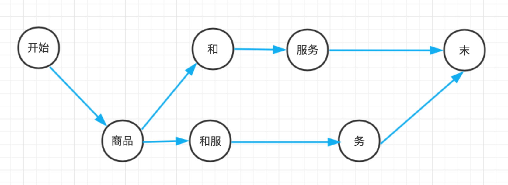

# 二元语法与中文分词

[TOC]

在词典分组中，主要实现的是基于规则的中文分词，特点是快而不准。统计自然语言处理的核心话题之一，就是如何利用统计手法对语言建模。

## 1 语言模型

### 1.1 什么是语言模型

**模型**指的是对事物的数学抽象，那么**语言模型（Language Model，LM）**指的就是对语言现象的数学抽象。确切来讲，给定一个句子$w$，语言模型就是计算句子的出现概率$p(w)$的模型。这个概率分布来自于某个人工标注而成的语料库。

假设标注一个微型的语料库，语料库有且仅有如下三个句子：

```
商品 和 服务
商品 和服 物美价廉
服务 和 货币
```

基于此语料库上的技术统计，语料库中的每一个句子出现的概率均为1/3，其它句子出现的概率为0，这就是语言模型。然而$p(w)$ 的计算非常难：句子数量无穷无尽，无法枚举。即便是大型语料库，也只能“枚举”有限的数百万个句子。实际遇到的句子大部分都在语料库之外，意味着它们的概率都被当作0，这种现象被称为**数据稀疏**。

从单词构成句子的角度出发建模句子，把句子表示为单词列表$\pmb{w}=w_1w_2···w_k$，每个$w_t, t\in[1, k]$都是一个单词，然后可以定义语言模型：
$$
\begin{align}
p(\pmb{w}) &= p(w_1w_2···w_k) \\
           &= p(w_1|w_0)*p(w_2|w_0w_1)*···*p(w_{k+1}|w_0w_1w_2···w_k)\\
           &= \prod_{t=1}^{k+1}p(w_t|w_0w_1···w_{t-1})
\end{align}
$$
上式中，$w_0$=BOS（Begin of Sentence），$w_{k+1}$=EOS（End of Sentence），是用来标记首尾的两个特殊单词。从语言模型的表达式可以看出，语言模型模拟人们说话的顺序：给定已经说出口的词语序列，预测下一个单词出现的后验概率。

例如，统计p(商品 和 服务)的概率：
$$
\begin{align}
p(商品\ 和\ 服务) &= p(商品\ ｜\ BOS)p(和｜BOS\ 商品)p(服务｜BOS\ 商品\ 和)p(EOS｜BOS\ 商品\ 和\ 服务) \\
&=\frac{2}{3}*\frac{1}{2}*\frac{1}{1}*\frac{1}{1} \\
&=\frac{1}{3}
\end{align}
$$
再来统计一个语料库之外的句子出现的概率：
$$
\begin{align}
p(商品\ 和\ 货币) &= p(商品\ ｜\ BOS)p(和｜BOS\ 商品)p(货币｜BOS\ 商品\ 和)p(EOS｜BOS\ 商品\ 和\ 货币) \\
&=\frac{2}{3}*\frac{1}{2}*0*0 \\
&=0
\end{align}
$$
三个词的句子计算尚可，然而随着句子长度的增加，语言模型会遇到如下两个问题：

* **数据稀疏**，指的是长度越大的句子越难出现，可能统计不到频次，导致$p(w_{k}|w_0w_1w_2···w_{k-1})=0$。
* **计算代价大**，k 越大，需要存储的 p 就越多，即便用上字典树索引，依然代价不菲。

为了解决这两个问题，研究者将马尔可夫假设引入到了语言模型。

### 1.2 马尔可夫链与二元语法

**马尔可夫假设**简化语言模型的基本思想：给定时间线上有一串事件顺序发生，假设每个事件发生概率只取决于前一个事件，那么这串事件构成的因果链被称为**马尔可夫链**。 

在语言模型中，第t个事件指的是$w_t$作为第t个单词出现。也就是说，马尔可夫链假设每个单词现身的概率仅取决于前一个单词：
$$
p(w_t|w_0w_1···w_{t-1})=p(w_t|w_{t-1})
$$
由于每次计算只涉及连续两个单词的二元接续，此时的语言模型被称为**二元语法模型**：
$$
\begin{align}
p(\pmb{w}) &= p(w_1w_2···w_k) \\
           &= p(w_1|w_0)*p(w_2|w_1)*···*p(w_{k+1}|w_k)\\
           &= \prod_{t=1}^{k+1}p(w_t|w_{t-1})
\end{align}
$$
**由于语料库中二元连续的重复程度要高于整个句子的重要程度，所以缓解了数据稀疏的问题，另外二元连续的总数量远远小于句子的数量，存储和查询也得到了解决。**

例如，统计p(商品 和 服务)的概率：
$$
\begin{align}
p(商品\ 和\ 服务) &= p(商品\ ｜\ BOS)p(和｜商品)p(服务｜和)p(EOS｜服务) \\
&=\frac{2}{3}*\frac{1}{2}*\frac{1}{2}*\frac{1}{1} \\
&=\frac{1}{6}
\end{align}
$$
再来统计一个语料库之外的句子出现的概率：
$$
\begin{align}
p(商品\ 和\ 货币) &= p(商品｜BOS)p(和｜商品)p(货币｜和)p(EOS｜货币) \\
&=\frac{2}{3}*\frac{1}{2}*\frac{1}{2}*\frac{1}{1} \\
&=\frac{1}{6}
\end{align}
$$
原来语料库中的句子概率变小了，剩下的那部分分给了语料库之外的句子，这样就缓解了一部分数据稀疏问题。

### 1.3 n元语法

类似上面的思路，可以从二元语法模型扩展到n元语法模型。定义：每个单词的概率仅取决于该单词之前的n-1个单词，即：
$$
\begin{align}
p(\pmb{w}) &= \prod_{t=1}^{k+n-1}p(w_t|w_{t-n+1}···w_{t-1})
\end{align}
$$
特别地，当 n=1 时的 n 元语法称为**一元语法** ( unigram)；当 n=3 时的 n 元语法称为**三元语法**(tigam); n≥4时数据稀疏和计算代价又变得显著起来，实际工程中几乎不使用。

### 1.4 数据稀疏与平滑策略

对于n元语法模型，n越大，数据稀疏问题越严峻。即使是二元语法，许多二元接续靠语料库也统计不到。考虑到低阶n元语法更丰富，一个自然而然的解决方案就是利用低阶n元语法平滑高阶n元语法。所谓平滑，就是字面上的意思：是n元语法频次的折线平滑为曲线。例如，我们不希望二元语法“商品 货币”的频次突然降到0，因此用一元语法“商品”和“货币”的频次去平滑它。

平滑策略是语言模型研究的课题之一，最简单的一种是线性插值法，定义新的二元语法概率为：
$$
p(w_t|w_{t-1})=\lambda p_{ML}(w_t|w_{t-1}) + (1-\lambda)p(w_t)
$$
其中，λ∈(0,1)为常数平滑因子。

## 2. 中文分词语料库

语言模型只是一个函数的骨架，函数的参数需要在语料库上统计才能得到。为了满足实际工程需要，一个质量高、分量足的语料库必不可少。以下是常用的语料库：

- 《人民日报》语料库 PKU
- 微软亚洲研究院语料库 MSR
- 香港城市大学 CITYU(繁体)
- 台湾中央研究院 AS(繁体)

| 语料库 | 字符数 | 词语种数 | 总词频 | 平均词长 |
| ------ | ------ | -------- | ------ | -------- |
| PKU    | 183万  | 6万      | 111万  | 1.6      |
| MSR    | 405万  | 9万      | 237万  | 1.7      |
| AS     | 837万  | 14万     | 545万  | 1.5      |
| CITYU  | 240万  | 7万      | 146万  | 1.7      |

一般采用MSR作为分词语料的首选，有以下原因：

- 标注一致性上MSR要优于PKU。
- 切分颗粒度上MSR要优于PKU，MSR的机构名称不予切分，而PKU拆开。
- MSR中姓名作为一个整体，更符合习惯。
- MSR量级是PKU的两倍。

## 3. 模型训练与预测

对于二元语法模型，训练指的是统计二元语法频次以及一元语法频次。有了频次，通过极大似然估计以及平滑策略，我们就可以估计任意句子的概率分布，也即得到了语言模型。

### 3.1 训练

训练的步骤包括：

* **加载语料库**

  接口：CorpusLoader.convert2SentenceList(corpus_path)

  corpus_path可以指向MSR、PKU等语料库，也可以指向用户自行标注的语料库路径。convert2SentenceList返回的是List<List<IWord>>类型，每个List<IWord>都是一个句子，每个IWord都是一个单词。

* **统计一元语法和二元语法**

  在HanLP中，一元语法的统计功能由DictionaryMaker提供，二元语法的统计功能由NGramDictionaryMaker提供。语言模型由一元语法和二元语法构成，因此，HanLP提供两者的包装类NatureDictionaryMaker。python调用代码如下：

  ```python
  def train_bigram(corpus_path, model_path):
      sents = CorpusLoader.convert2SentenceList(corpus_path)
      for sent in sents:
          for word in sent:
              if word.label is None:
                  word.setLabel("n")
      maker = NatureDictionaryMaker()
      maker.compute(sents) # 实现词频统计
      maker.saveTxtTo(model_path)  # tests/data/my_cws_model
  ```

  运行后会分别在model_path下得到一元语法模型和二元语法模型。

### 3.2 预测

在机器学习和自然语言处理的语境下，预测指的是利用模型对样本（句子）进行推断的过程，在中文分词任务中也就是利用模型推断分词序列，有时候预测也称为解码。HanLP中二元语法的解码由ViterbiSegment分词器提供。

预测的过程包括：

* **加载模型**

  python调用代码如下：

  ```python
  def load_bigram(model_path, verbose=True, ret_viterbi=True):
      HanLP.Config.CoreDictionaryPath = model_path + ".txt"  # unigram
      HanLP.Config.BiGramDictionaryPath = model_path + ".ngram.txt"  # bigram
      CoreDictionary = LazyLoadingJClass('com.hankcs.hanlp.dictionary.CoreDictionary')
      CoreBiGramTableDictionary = SafeJClass('com.hankcs.hanlp.dictionary.CoreBiGramTableDictionary')
      if verbose:
          print(CoreDictionary.getTermFrequency("商品"))
          print(CoreBiGramTableDictionary.getBiFrequency("商品", "和"))
  ```

* **构建词网**

  词网指的是句子中所有一元语法构成的网状结构，是HanLP工程上的概念。比如“商品和服务”这个句子，给定一元语法词典，我们将句子中所有单词找出来，起始位置(offset)相同的单词写作一行，得到如下词网：

  ```
  [ ]
  [商品]
  []
  [和,和服]
  [服务]
  [务]
  [ ]
  ```

  其中首尾行(行1和行7)分别对应BOS和EOS，这里用空格表示。词网必须保证从起点出发的所有路径都会连通到终点。词网有一个极佳的**性质**：那就是第 $i$行的某个词语 $w$ 与第$ i+\text{len}(w)$ 行的所有词语相连都能构成二元语法。因此，将词网第$i$行中长为$l$的单词和第$i+l$行的所有单词互相连接，可以构成一个词图，如下图所示：

  

  从起点到终点的每条路径都代表了句子的一种分词方式，二元语法的解码任务就是找出其中最合理的那条路径。这就涉及到了每条路径的代价计算，因此需要找到一种衡量节点间距离的计算方式。

* **节点间的距离计算**

  如果赋予上述词图每条边以二元语法的概率作为距离，那么中文分词的任务就转换成了有向无环图的最长路径问题。

  二元语法概率可以利用MLE加以平滑策略得到，在中文分词中经常使用如下的经验公式：
  $$
  \hat{p}(w_t|w_{t-1})=\lambda \left[\mu \frac{c(w_{t-1}w_t)}{c(w_t)}+1-\mu\right]+(1-\lambda)\frac{c(w_t)+1}{N}
  $$
  其中，$\lambda,\mu\in(0,1)$为两个不同的平滑因子，也即上式额外做了一次平滑。频次加一其实也是一种平滑策略，称为加一平滑或拉普拉斯平滑。

  考虑到多个(0, 1)之间的浮点数相乘会发生下溢出（等于0），因此工程上常对概率取负对数，将浮点数乘法转换为负对数之间的加法：
  $$
  \prod_{t=1}^{k+1}\hat{p}(w_t|w_{t-1})\to -\sum_{t=1}^{k+1}\log\hat{p}(w_t|w_{t-1})
  $$
  相应的，词图上的最长路径转换成了负对数的最短路径问题。

* **维特比算法进行预测**

  如何求解词图上的最短路径问题？常用的算法有Bellman-Ford和Dijkstra算法。在自然语言处理领域，我们处理的是图的一种特例：由马尔可夫链构成的网状图，该特例上的最短路径算法称为**维特比算法（Viterbi Algorithm）**。

  维特比算法分为前向（forward）和后向（backward）两个步骤：

  * 前向：由起点出发从前往后遍历节点，更新从起点到该节点的最小花费以及前驱指针，每次只储存最优子路径，这样大大减小了时间复杂度。
  * 后向：由终点出发从后往前回溯前驱指针，取得最短路径。

  Viterbiu算法用python描述如下：

  ```python
  def viterbi(wordnet):
      nodes = wordnet.getVertexes()
      # 前向遍历
      for i in range(0, len(nodes) - 1):
          for node in nodes[i]:
              for to in nodes[i + len(node.realWord)]:
                  to.updateFrom(node)  # 根据距离公式计算节点距离，并维护最短路径上的前驱指针from
      # 后向回溯
      path = []  # 最短路径
      f = nodes[len(nodes) - 1].getFirst()  # 从终点回溯
      while f:
          path.insert(0, f)
          f = f.getFrom()  # 按前驱指针from回溯
      return [v.realWord for v in path]
  ```

### 3.3 测试

在先前构建的微型语料库上进行测试，包括训练模型，为商品和服务创建词图，最后运行维特比算法，python调用代码为：

```python
# -*- coding:utf-8 -*-
# Author：hankcs
# Date: 2018-06-06 13:19
# 《自然语言处理入门》3.3 训练
# 配套书籍：http://nlp.hankcs.com/book.php
# 讨论答疑：https://bbs.hankcs.com/
from jpype import JString

from pyhanlp import *
from tests.book.ch03.demo_corpus_loader import my_cws_corpus
from tests.book.ch03.msr import msr_model
from tests.test_utility import test_data_path

NatureDictionaryMaker = SafeJClass('com.hankcs.hanlp.corpus.dictionary.NatureDictionaryMaker')
CorpusLoader = SafeJClass('com.hankcs.hanlp.corpus.document.CorpusLoader')
WordNet = JClass('com.hankcs.hanlp.seg.common.WordNet')
Vertex = JClass('com.hankcs.hanlp.seg.common.Vertex')
ViterbiSegment = JClass('com.hankcs.hanlp.seg.Viterbi.ViterbiSegment')
DijkstraSegment = JClass('com.hankcs.hanlp.seg.Dijkstra.DijkstraSegment')
CoreDictionary = LazyLoadingJClass('com.hankcs.hanlp.dictionary.CoreDictionary')
Nature = JClass('com.hankcs.hanlp.corpus.tag.Nature')


def train_bigram(corpus_path, model_path):
    sents = CorpusLoader.convert2SentenceList(corpus_path)
    for sent in sents:
        for word in sent:
            if word.label is None:
                word.setLabel("n")
    maker = NatureDictionaryMaker()
    maker.compute(sents)
    maker.saveTxtTo(model_path)  # tests/data/my_cws_model.txt


def load_bigram(model_path, verbose=True, ret_viterbi=True):
    HanLP.Config.CoreDictionaryPath = model_path + ".txt"  # unigram
    HanLP.Config.BiGramDictionaryPath = model_path + ".ngram.txt"  # bigram
    CoreBiGramTableDictionary = SafeJClass('com.hankcs.hanlp.dictionary.CoreBiGramTableDictionary')
    CoreDictionary.getTermFrequency("商品")
    # 兼容代码结束
    if verbose:
        print(CoreDictionary.getTermFrequency("商品"))
        print(CoreBiGramTableDictionary.getBiFrequency("商品", "和"))
        sent = '商品和服务'
        # sent = '货币和服务'
        wordnet = generate_wordnet(sent, CoreDictionary.trie)
        print(wordnet)
        print(viterbi(wordnet))


def generate_wordnet(sent, trie):
    """
    生成词网
    :param sent: 句子
    :param trie: 词典（unigram）
    :return: 词网
    """
    searcher = trie.getSearcher(JString(sent), 0)
    wordnet = WordNet(sent)
    while searcher.next():
        wordnet.add(searcher.begin + 1,
                    Vertex(sent[searcher.begin:searcher.begin + searcher.length], searcher.value, searcher.index))
    # 原子分词，保证图连通
    vertexes = wordnet.getVertexes()
    i = 0
    while i < len(vertexes):
        if len(vertexes[i]) == 0:  # 空白行
            j = i + 1
            for j in range(i + 1, len(vertexes) - 1):  # 寻找第一个非空行 j
                if len(vertexes[j]):
                    break
            wordnet.add(i, Vertex.newPunctuationInstance(sent[i - 1: j - 1]))  # 填充[i, j)之间的空白行
            i = j
        else:
            i += len(vertexes[i][-1].realWord)

    return wordnet


def viterbi(wordnet):
    nodes = wordnet.getVertexes()
    # 前向遍历
    for i in range(0, len(nodes) - 1):
        for node in nodes[i]:
            for to in nodes[i + len(node.realWord)]:
                to.updateFrom(node)  # 根据距离公式计算节点距离，并维护最短路径上的前驱指针from
    # 后向回溯
    path = []  # 最短路径
    f = nodes[len(nodes) - 1].getFirst()  # 从终点回溯
    while f:
        path.insert(0, f)
        f = f.getFrom()  # 按前驱指针from回溯
    return [v.realWord for v in path]


if __name__ == '__main__':
    corpus_path = my_cws_corpus()
    model_path = os.path.join(test_data_path(), 'my_cws_model')
    train_bigram(corpus_path, model_path)
    load_bigram(model_path)

```

输出：

```
[' ', '商品', '和', '服务', ' ']
```

当输入为'货币和服务'时，输出：

```
[' ', '货币', '和', '服务', ' ']
```

结果说明二元语法模型具有一定的泛化能力。

### 3.4 用户词典的集成

词典往往廉价易得，资源丰富，利用统计模型的消歧能力，辅以用户词典处理新词，是提高分词器准确率的有效方式。HanLP支持 2 档用户词典优先级：

- **低优先级**：分词器首先在不考虑用户词典的情况下由统计模型预测分词结果，最后将该结果按照用户词典合并。默认低优先级。
- **高优先级**：分词器优先考虑用户词典，但具体实现由分词器子类自行决定。

**HanLP分词器简洁版**：

```python
from pyhanlp import *

ViterbiSegment = SafeJClass('com.hankcs.hanlp.seg.Viterbi.ViterbiSegment')

segment = ViterbiSegment()
sentence = "社会摇摆简称社会摇"
segment.enableCustomDictionary(False)
print("不挂载词典：", segment.seg(sentence))
CustomDictionary.insert("社会摇", "nz 100")
segment.enableCustomDictionary(True)
print("低优先级词典：", segment.seg(sentence))
segment.enableCustomDictionaryForcing(True)
print("高优先级词典：", segment.seg(sentence))
```

输出：

```
不挂载词典： [社会/n, 摇摆/v, 简称/v, 社会/n, 摇/v]
低优先级词典： [社会/n, 摇摆/v, 简称/v, 社会摇/nz]
高优先级词典： [社会摇/nz, 摆/v, 简称/v, 社会摇/nz]
```

可见，用户词典的高优先级未必是件好事，HanLP中的用户词典默认低优先级，做项目时请读者在理解上述说明的情况下根据实际需求自行开启高优先级。

### 3.5 二元语法与词典分词比较

按照NLP任务的一般流程，我们已经完成了语料标注和模型训练，现在来比较一下二元语法和词典分词的评测：

| 算法     | P     | R     | F1    | R(oov) | R(IV) |
| -------- | ----- | ----- | ----- | ------ | ----- |
| 最长匹配 | 89.41 | 94.64 | 91.95 | 2.58   | 97.14 |
| 二元语法 | 92.38 | 96.70 | 94.49 | 2.58   | 99.26 |

相较于词典分词，二元语法在精确度、召回率及IV召回率上全面胜出，最终F1值提高了 2.5%，成绩的提高主要受惠于消歧能力的提高。然而 OOV 召回依然是 n 元语法模型的硬伤，我们需要更强大的统计模型。