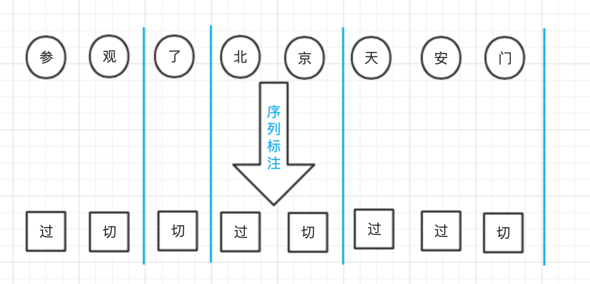
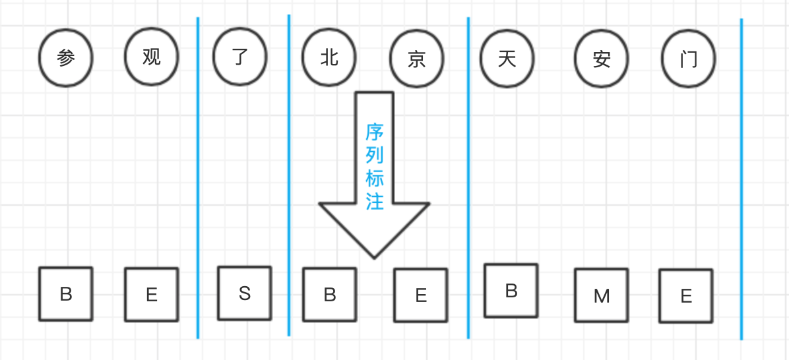
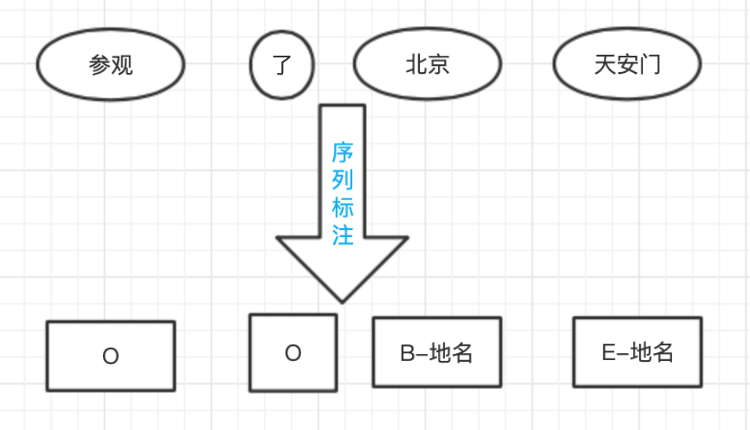
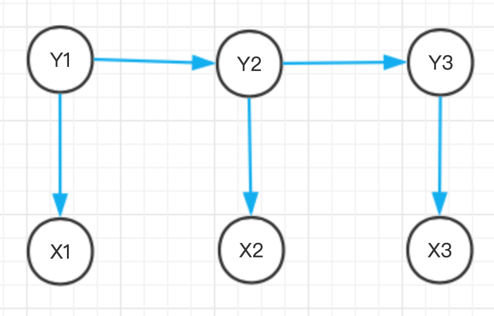
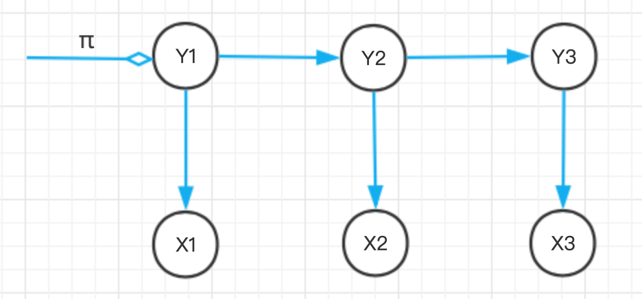
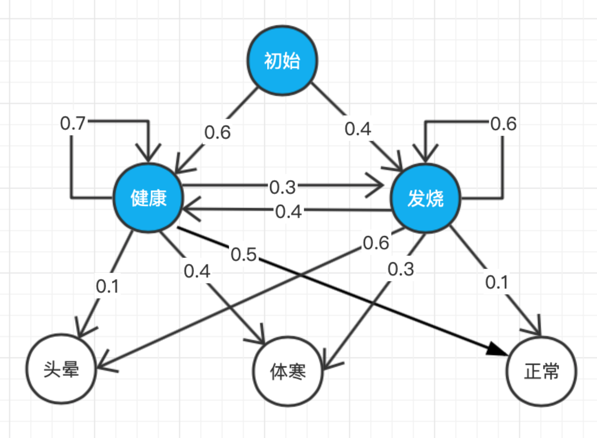
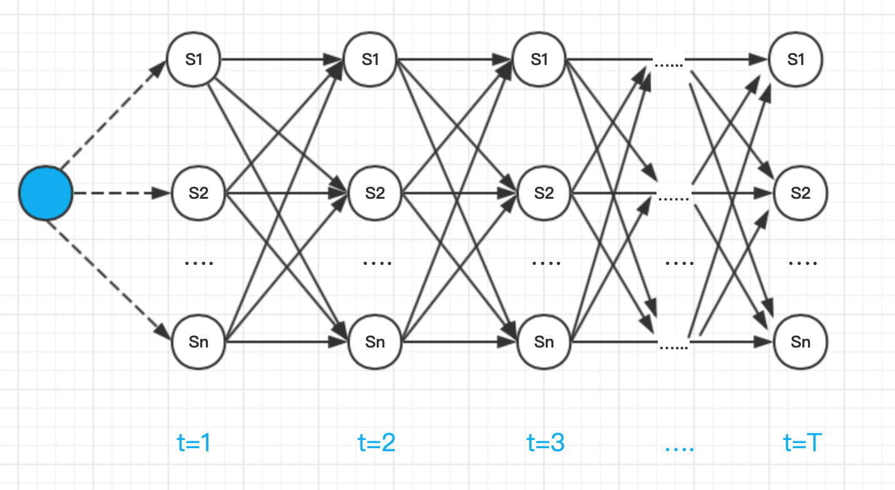

# 隐马尔可夫模型与序列标注

[TOC]

​		n元语法模型从词语的接续流畅度出发，为全切分词网中的二元接续打分，进而利用维特比算法求解似然概率最大的路径，然而，这种词语级别的模型无法应对OOV问题，因此，我们需要更细颗粒度的模型。比词语更细的颗粒就是字符。从字符的角度出发，只要将每个汉字组词时所处的位置（首尾等）作为标签，则中文分词就转换为给定汉字序列找出标签序列的问题，在所有的序列标注模型中，隐马尔可夫模型是最基础的一种。

## 1 序列标注问题

**序列标注**（tagging）指的是给定一个序列$\pmb{x}=x_1x_2···x_n$，找出序列中每个元素对应标签$\pmb{y}=y_1y_2 \cdots y_n$的问题。其中，$y$所有可能的取值集合称为**标注集**(tagset)。

求解序列标注问题的模型一般称为**序列标注器**，通常由模型从一个标注数据集${X,Y}={(x^{(i)},y^{(i)})},i=1,\dots,K$中学习相关知识后再进行预测。在NLP问题中，x 通常是字符或词语，而 y 则是待预测的组词角色或词性等标签。中文分词、词性标注以及命名实体识别，都可以转化为序列标注问题。

1. **序列标注与中文分词**

   考虑一个字符序列(字符串) x，想象切词器真的是在拿刀切割字符串，如此，中文分词转化为标注集{切，过}的序列标注问题。

   

   **分词标注集**并非只有一种，为了捕捉汉字分别作为词语收尾(**B**egin、**E**nd)、词中(**M**iddle)以及单字成词(**S**ingle)时不同的成词概率，人们提出了{B,M,E,S}这种最流行的标注集。

   

2. **序列标注与词性标注**

   词性标注任务是一个天然的序列标注问题：x 是单词序列，y 是相应的词性序列。需要综合考虑前后的单词与词性才能决定当前单词的词性。

   

3. **序列标注与命名实体识别**

   所谓**命名实体**，指的是现实存在的实体，比如人名、地名和机构名，命名实体是 OOV 的主要组成部分。

   考虑到字符级别中文分词和词语级别命名实体识别有着类似的特点，都是组合短单位形成长单位的问题。所以命名实体识别可以复用BMES标注集，并沿用中文分词的逻辑，只不过标注的对象由字符变为单词而已。唯一不同的是，命名实体识别还需要确定实体所属的类别。这个额外的要求依然是个标注问题，可以通过将命名实体类别附着到BMES标签来达到目的。比如，构成地名的单词标注为“B/M/E/S-地名”，以此类推。对于那些不构成命名实体的单词，则统-标注为O ( Outside), 即复合词之外。

   

总之，序列标注问题是NLP中最常见的问题之一。许多应用任务都可以变换思路，转化为序列标注来解决。所以一个准确的序列标注模型非常重要，直接关系到NLP系统的准确率。机器学习领域为NLP提供了许多标注模型，本着循序渐进的原则，本章介绍其中最基础的一个隐马尔可夫模型。

## 2 隐马尔可夫模型

**隐马尔可夫模型（Hidden Markov Model，HMM）**是描述两个时序序列联合分布$p(x,y)$的概率模型：$x$序列外界可见（外界指的是观测者），称为观测序列（observation sequence）；y序列外界不可见，称为状态序列（state sequence）。比如观测x为单词，状态y为词性，我们需要根据单词序列去猜测它们的词性，隐马尔可夫之所以称之为“隐”，是因为从外界来看，状态序列隐藏不可见，是代求的因变量。从这个角度来讲，人们也称状态为隐状态（hidden state），而称观测为显状态。同时，从命名可以看出，隐马尔可夫模型满足马尔科夫假设。

### 2.1 隐马尔可夫假设

马尔可夫假设：每个事件的发生概率只取决于前一个事件。

马尔可夫链：满足马尔可夫假设的多个事件串在一形成马尔可夫链。

如果将事件具象成单词，那么马尔可夫模型就具象成为二元语法模型。

隐马尔科夫模型假设：

1. 当前状态$y_t$仅仅依赖于前一个状态$y_{t-1}$，连续多个状态构成隐马尔可夫链y。
2. 任意时刻的观测序列$x_t$只依赖于当前时刻的状态$y_t$，与其它时刻的状态或观测独立无关。

如果用箭头表示事件的依赖关系(箭头终点是结果，依赖于起点的因缘)，则隐马尔可夫模型可以表示为下图所示：



状态与观测之间的依赖关系确定之后，隐马尔可夫模型利用三个要素来模拟时序序列的发生过程----即**初始状态概率向量、状态转移概率矩阵和发射概率矩阵**。

### 2.2 初始状态概率向量

系统启动时进入的第一个状态$y_1$称为**初始状态**，假设 y 有 N 种可能的取值，那么 $y_1$ 就是一个独立的离散型随机变量，由 $p(y_1|\pi)$ 描述。其中$\pi=(\pi_1,\pi_2,\dots,\pi_N)^T,0\leq\pi\leq1,\sum_{i=1}^N\pi_i=1$是概率分布的参数向量，称为**初始状态概率向量**。



给定 π ，初始状态 Y1 的取值分布就确定了，比如采用{B,M,E,S}标注集时概率如下：
$$
p(y_1=B)=0.7 \\
p(y_1=M)=0 \\
p(y_1=E)=0 \\
p(y_1=S)=0.3
$$
那么此时隐马尔可夫模型的初始状态概率向量为 π=[0.7，0，0，0.3]，注意，句子第一个词是单字的可能性要小一些。

### 2.3 状态转移概率矩阵

根据马尔可夫假设，t+1时刻的状态仅仅取决于t时刻的状态。既然一共有 N 种状态，那么从状态$s_i$ 到状态 $s_j$ 的概率就构成了一个 $N\times N$ 的方阵，称为**状态转移矩阵 A**：
$$
A=[p(y_{t+1}=s_j|y_t=s_i)]_{N\times N}
$$
其中下标i，j分别表示状态的第i，j种取值。

### 2.4 发射概率矩阵

根据隐马尔可夫假设2，当前观测$x_t$仅仅取决于当前状态$y_t$。也就是说，给定每种y，x都是一个独立的离散型随机变量，其参数对应一个向量。假设观测一共有M种可能的取值，即$x\in{o_1,\dots o_M}$，则x的概率分布参数向量维度为M。由于y一共有N种，所以这些参数向量构成了$N\times M$的矩阵，称为发射概率矩阵B。
$$
B=[p(x_t=o_i|y_t=s_j)]_{N\times M}
$$
其中，第i行j列的元素下标分别表示观测和状态的第i和第j种取值。

分别将状态转移矩阵A和发射概率矩阵B添加到示意图上，得到：


初始状态概率矩阵、状态转移概率矩阵和发射概率矩阵被称为隐马尔可夫模型的三元组$\lambda=(\pmb{\pi},\pmb{A},\pmb{B})$，只要三元组确定了，隐马尔可夫模型就确定了。

### 2.5 隐马尔可夫模型的用法

隐马尔可夫模型可用于：

1. **样本生成问题**：给定模型$\lambda=(\pmb{\pi},\pmb{A},\pmb{B})$，生成满足约束的样本，即一系列观测序列及其对应的状态序列${(x^{(i)},y^{(i)})}$。
2. **模型训练问题**：给定训练集${(x^{(i)},y^{(i)})}$，估计模型参数$\lambda=(\pmb{\pi},\pmb{A},\pmb{B})$。
3. **序列预测问题**：已知模型参数$\lambda=(\pmb{\pi},\pmb{A},\pmb{B})$，给定观测序列x，求最可能的状态序列y。

其中，样本生成问题和序列预测问题是模式识别的问题，前者根据隐马尔科夫模型得到一个可观察状态序列的概率(**评价**)；后者找到一个隐藏状态的序列使得这个序列产生一个可观察状态序列的概率最大(**解码**)。模型训练问题就是根据一个可以观察到的状态序列集产生一个隐马尔科夫模型（**学习**）。

## 3. 隐马尔可夫模型的样本生成

### 3.1 模型构造

设想如下案例:某医院招标开发“智能”医疗诊断系统，用来辅助感冒诊断。已知：

1. 来诊者只有两种状态:要么健康，要么发烧；
2. 来诊者不确定自己到底是哪种状态，只能回答感觉头晕、体寒或正常；
3. 感冒这种病，只跟病人前一天的状态有关；
4. 当天的病情决定当天的身体感觉。

现在有位来诊者的病历卡上完整地记录了最近 T 天的身体感受(头晕、体寒或正常)，请预测这 T 天的身体状态(健康或发烧)。由于医疗数据属于机密隐私，医院无法提供训练数据，但根据医生经验，感冒发病的规律如下图所示(**箭头上的数值表示概率**)：



根据已知条件①②，病情状态(健康、发烧)可作为隐马尔可夫模型的隐状态(上图蓝色状态)，而身体感受(头晕、体寒或正常)可作为隐马尔可夫模型的显状态(图中白色状态)。条件③符合隐马尔可夫模型假设一，条件④符 合隐马尔可夫模型假设二。这个案例其实描述了一个隐马尔可夫模型， 并且参数已经给定。构造模型代码见：

```python
import numpy as np
from pyhanlp import *
from jpype import JArray, JFloat, JInt

to_str = JClass('java.util.Arrays').toString

## 隐马尔可夫模型描述
states = ('Healthy', 'Fever')
start_probability = {'Healthy': 0.6, 'Fever': 0.4}
transition_probability = {
    'Healthy': {'Healthy': 0.7, 'Fever': 0.3},
    'Fever': {'Healthy': 0.4, 'Fever': 0.6},
}
emission_probability = {
    'Healthy': {'normal': 0.5, 'cold': 0.4, 'dizzy': 0.1},
    'Fever': {'normal': 0.1, 'cold': 0.3, 'dizzy': 0.6},
}
observations = ('normal', 'cold', 'dizzy')

def generate_index_map(labels):
    index_label = {}
    label_index = {}
    i = 0
    for l in labels:
        index_label[i] = l
        label_index[l] = i
        i += 1
    return label_index, index_label

states_label_index, states_index_label = generate_index_map(states)
observations_label_index, observations_index_label = generate_index_map(observations)

def convert_map_to_matrix(map, label_index1, label_index2):
    m = np.empty((len(label_index1), len(label_index2)), dtype=float)
    for line in map:
        for col in map[line]:
            m[label_index1[line]][label_index2[col]] = map[line][col]
    return JArray(JFloat, m.ndim)(m.tolist())

def convert_observations_to_index(observations, label_index):
    list = []
    for o in observations:
        list.append(label_index[o])
    return list

def convert_map_to_vector(map, label_index):
    v = np.empty(len(map), dtype=float)
    for e in map:
        v[label_index[e]] = map[e]
    return JArray(JFloat, v.ndim)(v.tolist())  # 将numpy数组转为Java数组


## pi：初始状态概率向量
## A：状态转移概率矩阵
## B：发射概率矩阵
A = convert_map_to_matrix(transition_probability, states_label_index, states_label_index)
B = convert_map_to_matrix(emission_probability, states_label_index, observations_label_index)
observations_index = convert_observations_to_index(observations, observations_label_index)
pi = convert_map_to_vector(start_probability, states_label_index)

FirstOrderHiddenMarkovModel = JClass('com.hankcs.hanlp.model.hmm.FirstOrderHiddenMarkovModel')
given_model = FirstOrderHiddenMarkovModel(pi, A, B)
```

### 3.2 样本生成算法

考虑长T的样本序列，它的生成过程就是沿着隐马尔可夫链走 T 步：

1. 根据初始状态概率向量采样第一个时刻的状态 $y_1 = s_i$，即 $y_1$~$\pmb{\pi}$。

2. $y_t$ 采样结束得到$s_i$后，根据状态转移概率矩阵第 $i$ 行的概率向量$\pmb{A}_{i,:}$，采样下一时刻的状态 $y_{t+1}$，即$y_{t+1}$~$\pmb{A}_{i,:}$

3. 对每个$y_t = s_i$，根据发射概率矩阵的第$i$行$\pmb{B}_{i,:}$采样$x_t$，即$x_{t}$~$\pmb{B}_{i,:}$

4. 重复步骤 2 共计 T-1 次，重复步骤 3 共计 T 次，输出序列 $\pmb{x}$ 与$\pmb y$。

代码实现如下：

```java
    public int[][] generate(int length)
    {
        double[] pi = logToCdf(start_probability);
        double[][] A = logToCdf(transition_probability);
        double[][] B = logToCdf(emission_probability);
        int xy[][] = new int[2][length];
        xy[1][0] = drawFrom(pi); // 采样首个隐状态
        xy[0][0] = drawFrom(B[xy[1][0]]); // 根据首个隐状态采样它的显状态
        for (int t = 1; t < length; t++)
        {
            xy[1][t] = drawFrom(A[xy[1][t - 1]]); // 根据上个隐状态采样当前的隐状态
            xy[0][t] = drawFrom(B[xy[1][t]]); // 根据当前隐状态采样它的显状态
        }
        return xy;
    }
```

样本生成调用代码用python描述如下：

```python
for O, S in given_model.generate(3, 5, 2):
    print(" ".join((observations_index_label[o] + '/' + states_index_label[s]) for o, s in zip(O, S)))
```

### 3.3 隐马尔可夫模型的训练

在监督学习中，用极大似然法来估计隐马尔可夫模型的三元组参数$\lambda=(\pmb{\pi},\pmb{A},\pmb{B})$。

1. **转移概率矩阵的估计**

   记样本序列在时刻t处于状态$s_i$，时刻t+1处于状态$s_j$。统计这样的转移频次计入矩阵元素$\pmb{A}_{i,j}$，则根据极大似然估计，从状态$s_i$到状态$s_j$的转移概率$a_{i,j}$可估计为矩阵第i行频次的归一化：
   $$
   \hat{a}_{i,j}=\frac{\pmb{A}_{i,j}}{\sum_{j=1}^{N}\pmb{A}_{i,j}},  \ \ \ \   i,j=1,2,\dots ,N
   $$

2. **初始状态概率向量的估计**

   初始状态其实可以看作是状态转移的一种特例，即$y_1$是由BOS转移而来。所以从BOS转移到$y_1$的转移频次只有一行，即统计$y_1$的所有取值的频次记作向量$\pmb{c}$，然后用类似的方法归一化：
   $$
   \hat{\pi_i}=\frac{\pmb{c}_i}{\sum_{i=1}^{N}\pmb{c}_i}  \ \ \ \   i,j=1,2,\dots ,N
   $$

3. **发射概率矩阵的估计**

   统计样本中状态为$y_t=s_i$且观测为$x_t=o_j$的频次，计入矩阵元素$\pmb{B}_{i,j}$，则状态$s_i$发射观测$o_j$的概率估计为：
   $$
   \hat{b}_{i,j}=\frac{\pmb{B}_{i,j}}{\sum_{j=1}^{M}\pmb{B}_{i,j}},  \ \ \ \   i=1,2,\dots ,N,\ \ j=1,2,\dots ,M
   $$

训练过程的代码用Java描述如下：

```java
    public void train(Collection<int[][]> samples)
    {
        if (samples.isEmpty()) return;
        int max_state = 0;
        int max_obser = 0;
        for (int[][] sample : samples)
        {
            if (sample.length != 2 || sample[0].length != sample[1].length) throw new IllegalArgumentException("非法样本");
            for (int o : sample[0])
                max_obser = Math.max(max_obser, o);
            for (int s : sample[1])
                max_state = Math.max(max_state, s);
        }
        estimateStartProbability(samples, max_state);
        estimateTransitionProbability(samples, max_state);
        estimateEmissionProbability(samples, max_state, max_obser);
        toLog();
    }
```

调用代码如下：

```java
    public void testTrain() throws Exception
    {
        FirstOrderHiddenMarkovModel givenModel = new FirstOrderHiddenMarkovModel(start_probability, transition_probability, emission_probability);
        FirstOrderHiddenMarkovModel trainedModel = new FirstOrderHiddenMarkovModel();
        trainedModel.train(givenModel.generate(3, 10, 100000));
        assertTrue(trainedModel.similar(givenModel));
    }
```

### 3.4 隐马尔可夫模型的预测

隐马尔可夫模型最具实际意义的问题当属序列标注了：给定观测序列，求解最可能的状态序列及其概率。

#### 3.4.1 概率计算的前向算法

给定观测序列x和状态序列y，如何估计两者的联合概率分布$p(x,y)$？
$$
p(x,y)=p(x\mid y)\cdotp(y)
$$

1. 顺着马尔可夫链走，首先t=1时，初始状态没有前驱状态，其发生概率由$\pmb{\pi}$决定，即：

$$
p(y_1=s_i)=\pmb{\pi}_i
$$

2. 对于$t\geq2$，状态$y_t$由前驱状态$y_{t-1}$转移而来，其转移概率由矩阵$\pmb{A}$决定，即：

$$
p(y_{t}=s_j|y_{t-1}=s_i)=\pmb{A}_{i,j}
$$

3. 计算状态序列的概率：

$$
p(\pmb{y})=p(y_1,\dots,y_T)=p(y_1)\prod_{t=2}^{T}p(y_{t}|y_{t-1})
$$

4. 对于每个$y_{t}=s_i$，都会发射一个$x_{t}=o_j$，其发射概率由矩阵$\pmb{B}$决定，即：

$$
p(x_{t}=o_j|y_{t}=s_i)=\pmb{B}_{i,j}
$$

5. 那么定长T的状态序列y，对应的x的概率就是上式的累积形式：

$$
p(\pmb{x}|\pmb{y})=\prod_{t=1}^{T}p(x_{t}|y_{t})
$$

6. 计算显隐状态的联合概率分布：

$$
\begin{align}
p(\pmb x,\pmb y) &= p(\pmb y)p(\pmb x | \pmb y) \\
&= p(y_1)\prod_{t=2}^{T}p(y_{t}|y_{t-1})\prod_{t=1}^{T}p(x_{t}|y_{t})
\end{align}
$$

将其中的每个$y_{t}，x_{t}$对应上实际发生序列的$s_i$，$o_j$，就能代入$(\pmb{\pi},\pmb{A},\pmb{B})$中的相应元素，从而计算出任意序列的概率，最后寻找使得发生概率最大的序列作为预测结果，此时需要使用维特比算法。

#### 3.4.2 搜索状态序列的维特比算法

理解了前向算法之后，找寻最大概率所对应的状态序列无非是一个搜索问题。具体说来，将每个状态作为有向图中的一个节点， 节点间的距离由转移概率决定，节点本身的花费由发射概率决定。那么所有备选状态构成一幅有向无环图，待求的概率最大的状态序列就是图中的最长路径，此时的搜索算法称为**维特比算法**，如下图所示：



上图从左往右时序递增，虚线由初始状态概率决定，实线则是转移概率。由于受到观测序列的约束，不同状态发射观测的概率不同，所以每个节点本身也必须计算自己的花费，由发射概率决定。

又由于$y_{t+1}$仅依赖于 $y_t$，所以网状图可以**动态规划的搜索**：定义二维数组$\pmb\delta_{t,i}$表示在时刻t以$s_i$结尾的所有局部路径的最大概率，从t=1逐步递推到t=T。每次递推都在上一次的N条局部路径中挑选，所以时间复杂度为O(TN)。为了追踪最优路径，我们还必须记录每个状态的前驱：定义另一个数组$\pmb\psi_{t,i}$，下标定义与$\pmb\delta_{t,i}$相同，存储最优路径末状态$y_t$的前驱状态。

**维特比算法**描述为：

1. 初始化，t=1时初始最优路径的备选由N个状态组成，它们的前驱为空。

$$
\begin{align}
\pmb\delta_{1,i} &=\pmb\pi_i\pmb B_{i,o_1},& i=1,\dots,N \\
\pmb\psi_{1,i} &=0,& i=1,\dots,N
\end{align}
$$

2. 递推，t >= 2 时每条备选路径像贪吃蛇一样吃入一个新状态，长度增加一个单位，根据转移概率和发射概率计算花费。找出新的局部最优路径，更新$\pmb\psi$，$\pmb\delta$ 两个数组。

$$
\begin{align}
\pmb\delta_{t,i} &=\max_{1\leq j\leq N}(\pmb\delta_{t-1,j}\pmb A_{j,i})\pmb B_{i,o_t},& i=1,\dots,N \\
\pmb\psi_{1,i} &=\underset{1\leq j\leq N}{\text{argmax}}(\pmb\delta_{t-1,j}\pmb A_{j,i}),& i=1,\dots,N
\end{align}
$$

3. 终止，找出最终时刻$\pmb\delta_{T,i}$数组中的最大概率$p^*$，以及相应的结尾状态下标$i^*_T$。
   $$
   \begin{align}
   p^* &=\max_{1 \leq i \leq N}\pmb\delta_{T,i} \\
   i^*_T &=\underset{1\leq j\leq N}{\text{argmax}}\ \pmb\delta_{T,i}
   \end{align}
   $$

4. 回溯，根据前驱数组$\pmb\psi$回溯前驱状态，取得最优路径状态下标$\pmb i^*=i^*_1,\dots i_T^*$。
   $$
   \pmb i_t^*=\pmb\psi_{t+1,i^*_{t+1}}, \ \ \ t=T-1,T-2,\dots, 1
   $$

预测代码python描述如下：

```python
pred = JArray(JInt, 1)([0, 0, 0])
prob = given_model.predict(observations_index, pred)
print(" ".join((observations_index_label[o] + '/' + states_index_label[s]) for o, s in
               zip(observations_index, pred)) + " {:.3f}".format(np.math.exp(prob)))
```

输出：

```
normal/Healthy cold/Healthy dizzy/Fever 0.015
```

### 3.5 隐马尔可夫模型应用于中文分词

HanLP已经实现了基于隐马尔可夫模型的中文分词器HMMSegment，并且实现了训练接口。

训练接口调用代码python描述如下：

```python
FirstOrderHiddenMarkovModel = JClass('com.hankcs.hanlp.model.hmm.FirstOrderHiddenMarkovModel')
SecondOrderHiddenMarkovModel = JClass('com.hankcs.hanlp.model.hmm.SecondOrderHiddenMarkovModel')
HMMSegmenter = JClass('com.hankcs.hanlp.model.hmm.HMMSegmenter')

def train(corpus, model):
    segmenter = HMMSegmenter(model) # 传入空白的HiddenMarkovModel以创建分词器
    segmenter.train(corpus)
    print(segmenter.segment('商品和服务'))  # 调用segment方法实现中文分词
    return segmenter.toSegment()  # 将分词器转换成Segment接口

def evaluate(segment):
    result = CWSEvaluator.evaluate(segment, msr_test, msr_output, msr_gold, msr_dict) # 评测
    print(result)

if __name__ == '__main__':
    segment = train(msr_train, FirstOrderHiddenMarkovModel())  # 传入一阶马尔可夫模型
    evaluate(segment)
    segment = train(msr_train, SecondOrderHiddenMarkovModel())  # 传入二阶马尔可夫模型
    evaluate(segment)
```

### 3.6 性能评测

使用 MSR语料库进行评测，结果如下表所示：

| 算法               | P     | R     | F1    | R(oov) | R(IV) |
| ------------------ | ----- | ----- | ----- | ------ | ----- |
| 最长匹配           | 89.41 | 94.64 | 91.95 | 2.58   | 97.14 |
| 二元语法           | 92.38 | 96.70 | 94.49 | 2.58   | 99.26 |
| 一阶隐马尔可夫模型 | 78.49 | 80.38 | 79.42 | 41.11  | 81.44 |
| 二阶隐马尔可夫模型 | 78.34 | 80.01 | 79.16 | 42.06  | 81.04 |

可以看到，二阶隐马尔可夫模型的 Roov 有少许提升，但综合 F1 反而下降了。这说明增加隐马尔可夫模型的阶数并不能提高分词器的准确率，单靠提高转移概率矩阵的复杂度并不能提高模型的拟合能力，我们需要从别的方面想办法。目前市面上一些开源分词器仍然停留在一阶隐马尔可夫模型的水平，比如著名的结巴分词，它们的准确率也只能达到80%左右。

### 3.7 总结

这一章我们想解决的问题是新词识别，为此从词语级模型切换到字符级模型，将中文分词任务转换为序列标注问题。作为新手起步，我们尝试了最简单的序列标注模型----隐马尔可夫模型。隐马尔可夫模型的基本问题有三个：**样本生成、参数估计、序列预测**。

然而隐马尔可夫模型用于中文分词的效果并不理想，虽然召回了一半的 OOV，但综合 F1 甚至低于词典分词。哪怕升级到二阶隐马尔可夫模型， F1 值依然没有提升。 看来朴素的隐马尔可夫模型不适合中文分词，我们需要更高级的模型。

话说回来，隐马尔可夫模型作为入门模型，比较容易上手，同时也是许多高级模型的基础。打好基础，我们才能挑战高级模型。