# 条件随机场与序列标注

[TOC]

本章介绍一种新的序列标注模型条件随机场。这种模型与感知机同属结构化学习大家族，但性能比感知机还要强大。为了厘清该模型的来龙去脉，我们先对机器学习模型做一番梳理。然后结合代码介绍条件随机场理论，探究它与结构化感知机的异同。

## 1. 机器学习的模型谱系

机器学习的模型谱系如下图所示：

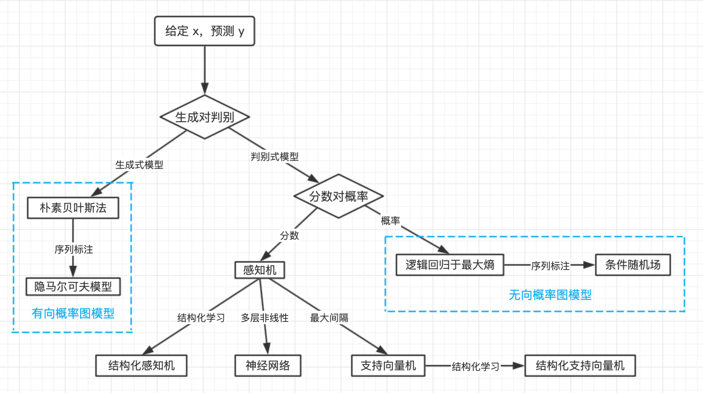

根据建模的究竟是联合概率分布 P(x,y) 还是条件概率分布 P(y|x)。派生出**生成式模型**与**判别式模型**。

1. **生成式模型**

   **生成式模型**：模拟数据的生成过程，两类随机变量存在因果先后关系，先有因素 y，后有结果 x，这种因果关系由联合分布模拟：

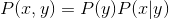

​		通过联合分布 P(x,y)，生成式模型其实间接建模了 P(x)：

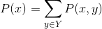

​		这里有两个缺陷:

​		* P(x) 很难准确估计，因为特征之间并非相互独立，而是存在错综复杂的依赖关系。

​		* P(x) 在分类中也没有直接作用。

​		为了克服这两个问题，判别式模型出现。

2. **判别式模型**

   判别式模型直接跳过了 P(x)，直接**对条件概率 P(y|x) 建模**。不管 x 内部存在多复杂的关系，也不影响判别式模型对 y 的判断，于是就能够**放心大胆的利用各种各样丰富的、有关联的特征**。 所以我们会看到感知机分词的准确率高于隐马尔可夫模型。

   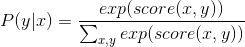

​		其中，exp 为指数函数。随机变量关系错综复杂，为了分析这些关系，使用**概率图模型**。

​		**概率图模型**( Probabilistic Graphical Model, PGM)是用来表示与推断多维随机变量联合分布 p(x,y) 的强大框架，被广泛用于计算机视觉、知识表达、贝叶斯统计与自然语言处理。它利用节点 V 来表示随机变量，用边 E 连接有关联的随机变量，将多维随机变量分布表示为图 G=(V,E)。这样就带来了一个好处，那就是整个图可以分解为子图再进行分析.子图中的随机变量更少，建模更加简单。具体如何分解，据此派生出有向图模型和无向图模型。

3. **有向概率图模型**

   **有向图模型**按事件的先后因果顺序将节点连接为有向图。如果事件 A 导致事件 B，则用箭头连接两个事件 A-->B。

   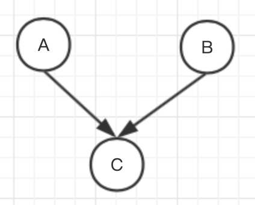

   有向图模型都将概率有向图分解为一系列条件概率之积，有向图模型经常用生成式模型来实现。定义 π(v) 表示节点 v 的所有前驱节点，则分布为:

   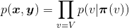

4. **无向概率图模型**

   相反，**无向图模型**则不探究每个事件的因果关系，也就是说不涉及条件概率分解。无向图模型的边没有方向，仅仅代表两个事件有关联。

   

   无向图模型将概率分解为所有最大团上的某种函数之积。

   在图论中，**最大团**指的是满足所有节点相互连接的最大子图。因为最大团需要考虑所有变量，为此，无向图模型定义了一些虚拟的**因子节点**，每个因子节点只连接部分节点，组成更小的最大团。

   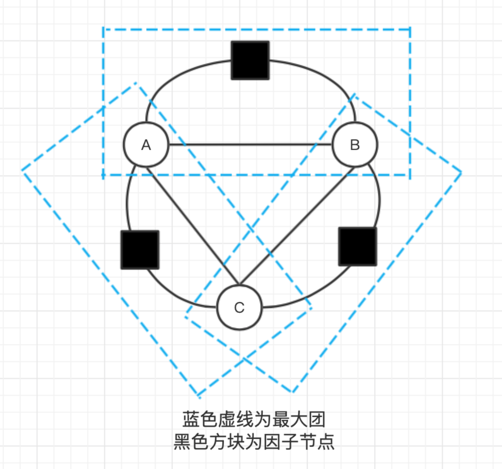

蓝色虚线表示最大团，黑色方块表因子节点，圆圈则表示变量节点，无向图模型将多维随机变量的联合分布分解为一系列最大团中的因子之积:


其中，a 是因子节点，$Ψa$ 则是一个因子节点对应的函数，参数 $x_a,y_a$ 是与因子节点相连的所有变量节点。为了将式子约束为概率分布，定义常数 Z 为如下归一化因子:

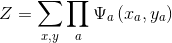

在机器学习中，常用指数家族的因子函数:

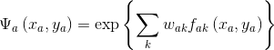

其中，$k$ 为特征的编号,  $f_{ak}$是特征函数，$\omega_{ak}$ 为相应的特征权重。

判别式模型经常用无向图来表示，只需要在归一化时，对每种$x$都求一个归一化因子:

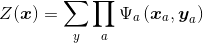

然后 $P(x,y)$ 就转化为判别式模型所需的条件概率分布:

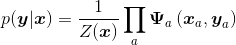

到这里，最后一个公式就是条件随机场的一般形式。

## 2 条件随机场

**条件随机场**( Conditional Random Field, CRF)是一种给定输入随机变量 $\pmb x$，求解条件概率 $p(\pmb y|\pmb x)$的概率无向图模型。用于序列标注时，特例化为线性链( linear chain )条件随机场。此时，输人输出随机变量为等长的两个序列。

### 2.1 **线性链条件随机场**

线性链条件随机场如下图所示:

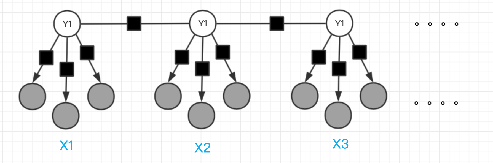

每个$\pmb x_t$上方有三个灰色节点，代表$\pmb x_t$的三个特征（当然，特征数量是任意的）。相较于隐马尔可夫模型对$\pmb x_t$提取的唯一特征，条件随机场可利用的特征更加丰富。图中黑色方块为因子节点，可以理解为一个特征函数$f_k(y_{t-1},y_t,\pmb x_t)$。其中仅仅利用了$\pmb x_t$和$y_t$的特征称作状态特征，利用了$y_{t-1}$的特征称作转移特征，与感知机的特征函数定义相同。

**线性链条件随机场**的定义如下:

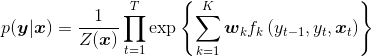

其中，$Z(x)$为归一化函数：

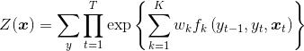

上式定义在所有可能的标注序列上。如果将所有特征函数与权重分别写作向量形式$\phi(y_{t-1},y_t,\pmb x_t),\omega \in \R^{K\times1}$，则线性链条件随机场的定义可简化为:

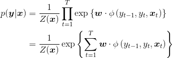

对比结构化感知机的打分函数:

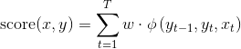

可以发现结构化感知机打分函数与条件随机场的指数部分完全相同，由于给定实例 x，Z(x) 就是一个常数 c，所以有:

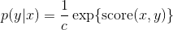

于是，条件随机场就和结构化感知机有以下联系:

- 条件随机场和结构化感知机的特征函数完全一致。
- 结构化感知机预测打分越高，条件随机场给予该预测的概率也越大。

这种相似性使得我们能够复用结构化感知机的预测算法，也就是维特比算法。

### 2.2 条件随机场的训练

给定训练集$D=\{ \pmb x^{(i)},\pmb y^{(i)} \}_{i=1}^N$，其中每个$\pmb x^{(i)}=\{\pmb x_1^{(i)},\pmb x_2^{(i)},\cdots,\pmb x_T^{(i)} \}$为输入序列，$\pmb y^{(i)}=\{ y_1^{(i)},y_2^{(i)},\cdots,y_T^{(i)} \}$为相应的标签序列。根据极大似然估计，

我们想要最大化给定模型参数$\pmb \omega$时训练集D的似然概率：
$$
p(D|\pmb \omega)=\prod_{i=1}^Np(y^{(i)}|\pmb x^{(i)})
$$
等价于极大化对数似然函数：
$$
L(\pmb \omega)=\sum_{i=1}^N\log p(y^{(i)}|\pmb x^{(i)})
$$
似然函数展开得：
$$
L(\pmb \omega)=\sum_{i=1}^N\sum_{t=1}^T\sum_{k=1}^K\pmb \omega_k f_k(y_{t-1}^{(i)},y_t^{(i)},\pmb x_t^{(i)})-\sum_{i=1}^N\log  Z(\pmb x^{(i)})
$$
对似然函数求偏导的得：
$$
\frac{\partial L}{\partial \pmb \omega_k}=\sum_{i=1}^N\sum_{t=1}^T f_k(y_{t-1}^{(i)},y_t^{(i)},\pmb x_t^{(i)})-\sum_{i=1}^N\sum_{t=1}^T\sum_{y_{t-1},y_t \in Y} f_k(y_{t-1},y_t,\pmb x_t^{(i)})p(y_{t-1},y_t\mid\pmb x_t^{(i)})
$$
上式中的第一项为特征函数$f_k$输出值在经验分布下的期望，第二项由log(Z(x))的导数产生。

接下来使用常见的随机梯度下降算法或者拟牛顿算法求解函数的极值。

### 2.3 **对比结构化感知机**

结构化感知机和条件随机场的**相同点**:

- 特征函数相同
- 权重向量相同
- 打分函数相同
- 预测算法相同
- 同属结构化学习

**不同点**

- 感知机更新参数时，只使用一个训练实例，没有考虑整个数据集，难免顾此失彼；而条件随机场对数似然函数及其梯度则使用了整个数据集。

- 条件随机场更新参数更加合理，条件随机场更新参数如下:

  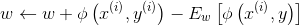

  对比感知机的更新参数表达式:

  

  两者的差距一目了然，感知机奖励正确答案对应的特征函数 ϕ，但仅惩罚错误最厉害的那个 y，而条件随机场同时惩罚所有答案 y，分摊惩罚总量。

### 2.4 条件随机场工具包

谈到条件随机场工具包，最著名的就是 CRF++，有各大平台的安装方法，HanLP已经集成了。

CRF++ 接受纯文本语料，约定为一种空格或制表符分隔的表格格式。每个序列作为一个表格，每行为序列的一个时刻 Xt,Yt，除了最后一列为输出变量 y 之外，其它列都是输入变量 x，如下所示:

```
商 s 中 B
品 p 中 E
和 h 中 S
服 f 中 B
务 w 中 E

A a 英 B
K k 英 M
B b 英 M
4 s 数 M
8 b 数 E
```

### 2.5 HanLP中的CRF++ API

python调用代码示例：

```python
# -*- coding:utf-8 -*-
# Author：hankcs
# Date: 2018-07-01 19:15
# 《自然语言处理入门》6.4 HanLP 中的 CRF++ API
# 配套书籍：http://nlp.hankcs.com/book.php
# 讨论答疑：https://bbs.hankcs.com/
from pyhanlp import *
from pyhanlp.static import HANLP_JAR_PATH
from tests.book.ch03.demo_corpus_loader import my_cws_corpus
from tests.test_utility import test_data_path

CRFSegmenter = JClass('com.hankcs.hanlp.model.crf.CRFSegmenter')

TXT_CORPUS_PATH = my_cws_corpus()
TSV_CORPUS_PATH = TXT_CORPUS_PATH + ".tsv"
TEMPLATE_PATH = test_data_path() + "/cws-template.txt"
CRF_MODEL_PATH = test_data_path() + "/crf-cws-model"
CRF_MODEL_TXT_PATH = test_data_path() + "/crf-cws-model.txt"


def train_or_load(corpus_txt_path=TXT_CORPUS_PATH, model_txt_path=CRF_MODEL_TXT_PATH):
    if os.path.isfile(model_txt_path):  # 已训练，直接加载
        segmenter = CRFSegmenter(model_txt_path)
        return segmenter
    else:
        segmenter = CRFSegmenter()  # 创建空白分词器
        segmenter.convertCorpus(corpus_txt_path, TSV_CORPUS_PATH)  # 执行转换
        segmenter.dumpTemplate(TEMPLATE_PATH)  # 导出特征模板
        # 交给CRF++训练
        print("语料已转换为 %s ，特征模板已导出为 %s" % (TSV_CORPUS_PATH, TEMPLATE_PATH))
        print("请安装CRF++后执行 crf_learn -f 3 -c 4.0 %s %s %s -t" % (TEMPLATE_PATH, TSV_CORPUS_PATH, CRF_MODEL_PATH))
        print("或者执行移植版 java -cp %s com.hankcs.hanlp.model.crf.crfpp.crf_learn -f 3 -c 4.0 %s %s %s -t" % (
            HANLP_JAR_PATH, TEMPLATE_PATH, TSV_CORPUS_PATH, CRF_MODEL_PATH))


if __name__ == '__main__':
    segment = train_or_load()
    if segment:
        print(segment.segment("商品和服务"))
```

训练耗时很长。

**标准化评测**

| 算法         | P     | R     | F1    | R(oov) | R(IV) |
| ------------ | ----- | ----- | ----- | ------ | ----- |
| 最长匹配     | 89.41 | 94.64 | 91.95 | 2.58   | 97.14 |
| 二元语法     | 92.38 | 96.70 | 94.49 | 2.58   | 99.26 |
| 一阶HHM      | 78.49 | 80.38 | 79.42 | 41.11  | 81.44 |
| 二阶HHM      | 78.34 | 80.01 | 79.16 | 42.06  | 81.04 |
| 平均感知机   | 96.69 | 96.45 | 96.57 | 70.34  | 97.16 |
| 结构化感知机 | 96.67 | 96.64 | 96.65 | 70.52  | 97.35 |
| 条件随机场   | 96.86 | 96.64 | 96.75 | 71.54  | 97.33 |

条件随机场的各项指标全面胜过了结构化感知机，综合 F1 更达到 96.8%， 是传统方法中最准确的分词模型。